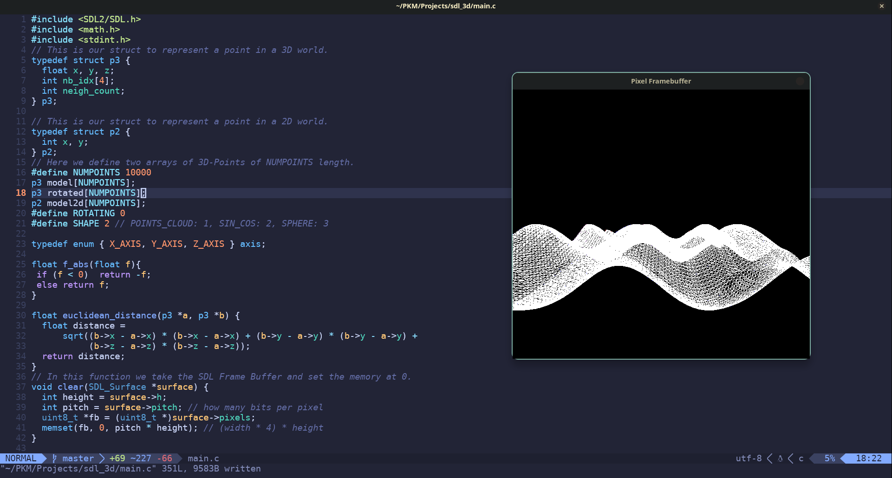

## Presentation

Here we are. Yet another tech blog that talks about the latest AI stuff that comes up this morning? "Ehm...yes, but actually not".

But, first of all, let me introduce myself. I'm a 25yo Software Engineer based in Italy. I've studied Computer Science Engineering, Artificial Intelligence and Robotics in university. And now I work as a Software Engineer in Rome.

## Why a Blog?

Why do I want to start blogging? I think there are almost three reasons:

I want to improve my English for sure. Almost all my reads (technical stuffs, fiction books, manga, etc) are in English, but I'm not that good at speaking and at writing down my thoughts.

The second reason is that, nowadays, the world is changing, in a way or in the other. In particular the work of a Software Engineer is changing so fast, and I'm worried. I'm worried about the unknown, the randomness of my field. I've studied for so many years, keeping in mind a fixed map of what this job was, and now everything is falling apart. I (and like me, many other young programmers) don't have an anchor, a fixed star to follow (well, there are some, but I'll talk about that later). And the scariest thing is that I've the worry of being (yes, mainly jobless, but in particular...) useless, pointless. It isn't like a FOMO fear, it is more like the fear of doing the *wrong* thing (maybe I will be more precise in the future).

From the second reason, we can branch another stream: study. In university (and in all the undergraduate schools), to study is mandatory of course, but for me it has always been a pleasure. The feeling when new information enters my *brain graph* as a new atomic cell that links to some others, and could build new *bridges*, new *paths* between concepts, is priceless. But now, with the work life and the other adulthood stuff, it's very difficult to find the time and the strength to sit in front of the personal pc in my free time and study (in particular when I have to study some hard tech stuff). So, maybe if I rule myself to write down what I'm learning on a blog, it could help me gain the right motivation.

## Yes, but what am I studying?

Let me first talk about AI in university. I think that I was really lucky to study in a university where the courses about AI and in particular Deep Learning were so well made (thanks to an enlightened professor too). In the field of AI, I've faced:

A first general course about how some problems cannot be solved by a closed form algorithm, and how the need to use all the family of Genetic Algorithms and a primitive attempt at an MLP was born.

Then a course about Machine Learning. It was so interesting. I've learned how to manipulate data, how to extract information from them, and how it's frustrating to work with an impure dataset. Then I've learned many *tools* in order to perform evaluations and testing, such as Bayesian Learning, SVM, Random Forest, PCA, LDA, Confusion Matrix, Precision-Recall...I miss those things :'(.

Finally I've faced a course about Deep Learning, going very deep as I remember. I went through MLP, all kinds of losses, all kinds of activation functions, backpropagation, CNN, Recurrent NN, an interminable list of Backbones and famous structures of Neural Networks. It was so beautiful. Because mainly, for every concept, the professor was starting some mathematical deep dives of stunning complexity.

But now? Now the complexity of the field has increased in just a few months. The course now has many of the modern concepts, such as Transformers, Attention, Distillation and other interesting things, but...I'm not at school anymore...so I have to study those things on my own...:)

And here starts my journey on the web, searching for the best sources to increase my knowledge and trying to get rid of the FOMO. If I can give you advice about a course that I've faced, it is the [C course on YouTube](https://www.youtube.com/playlist?list=PLrEMgOSrS_3cFJpM2gdw8EGFyRBZOyAKY) made by [Antirez](https://antirez.com/), the creator of Redis (and let's give a welcome to one of the guiding stars that I'm following). It's in Italian language, but I think that the auto-generated subtitles could make it work.

Why have I faced this course? First of all, I've always thought that the bases are mandatory to know in every field. But that isn't the only reason. In this course, [Antirez](https://antirez.com/) shows the process behind his creations. How does he choose the name of a variable? How does he write the comments in order to make all his code a proper form of *Literature* ([there is a post](https://antirez.com/news/124) where he talks about all the kinds of comments in his code)? I think that all this information is very precious to anyone who works in this job. It's not merely a course about the C language. Instead it is a course about **Critical Thinking and Work Experience**. Some priceless stuff nowadays.

*A result from Antirez's C course.*

And now, I have the urge to continue my walk on the AI path. So I've taken a book advised by [Antirez](https://antirez.com/): *Deep Learning with Python* by Chollet, the creator of Keras. So my intention is to write down some kind of notes about all the things that I don't know yet. I would put them in my Personal Knowledge Management System (I'll talk about that in the future, maybe) and then extract a brief summary to put into the *Learn in Public* series of this blog.

I don't know if anybody will read me. But all this is mainly for me, rather than for others. But if someone reads me, I hope that he/she can find the thoughts that I'll write down useful in some ways.
