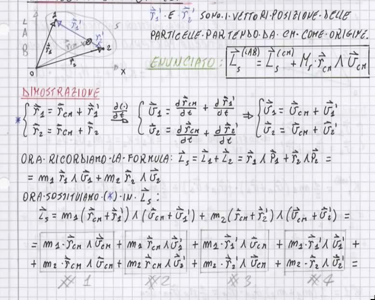
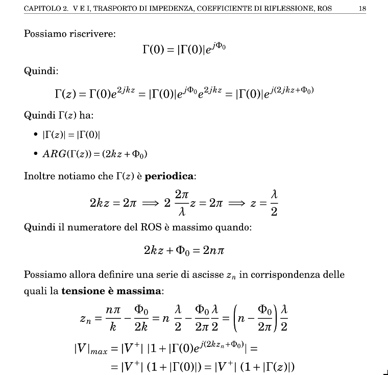
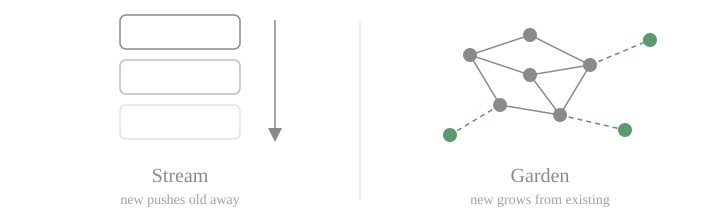
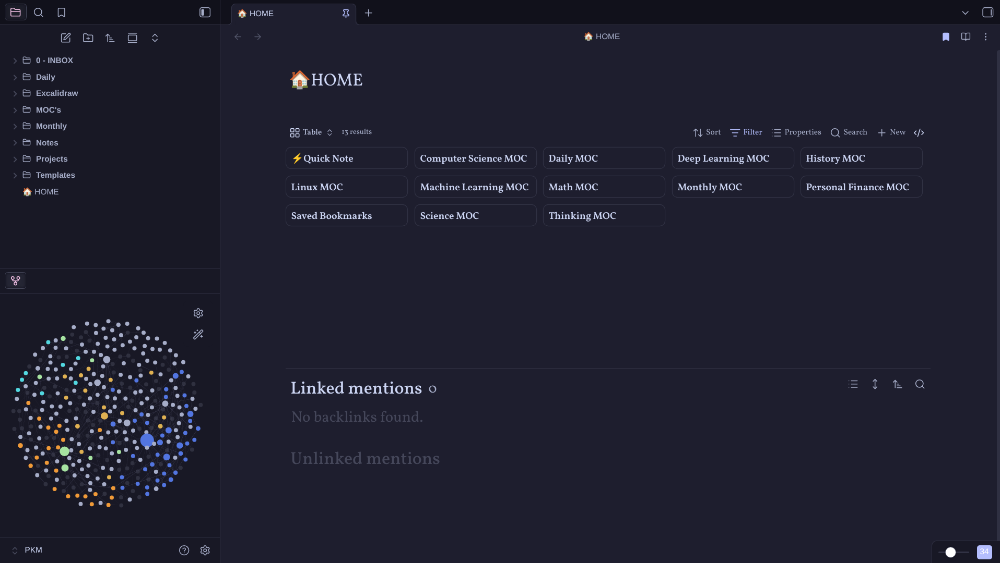
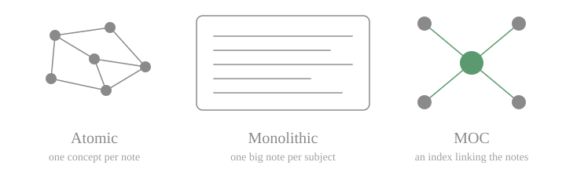

## Notes as effort

For all my school life, I've always taken notes. In high school I spent many hours trying to achieve the most structured, decorative and readable notes in my notebook, with tons of coloured pencils, arrows and other fancy stuff.

I was of the opinion that, in order to truly understand what you are studying, you have to elaborate on it and make something. A concept map, a presentation, a video lesson, anything. The important part is to end up with an artifact of your intellect made through your own hands. Something you put effort into.

And I think the same thing now. There is a sort of functional correlation between the effort put into crafting something and how long that information remains in your mind.

## The LaTeX years

In my university years I followed this line too, building structured notes in LaTeX (of which I'm very proud - flex moment). I needed to study from something made by myself. The leading star was:

> "I have to write down a version of the lecture book, with my own voice."

It's kind of like the *Feynman Technique*: explain what you are studying to yourself, as if you were talking to a child. But not quite the same thing, because the final artifact must contain all the important and detailed information of the lecture. All of it written in your own way of expressing things, your thoughts written down, some jokes that only you will read and laugh at (yes... it's a weird and sad thing to do...).

Did this method work? I think so. Well, it steals a lot of time, especially writing in LaTeX during the lessons, but with some tricks it was faster than writing on paper (yes, with figures and formulas too). As an engineer, it's always a pleasure to tune a method in order to boost some metrics. And with note-taking it was the same.

My setup was a Linux distro (I was in love with Pop!\_OS for many years) with LaTeX installed locally. Then I used VS Code with LaTeX Workshop and HyperSnips as extensions. The latter is the key extension: it lets you build snippets to speed up the creation of notes. For example, in LaTeX, building a table takes time because of all the boilerplate. With a snippet, you just type the keyword `tb` and a full table structure appears in your editor.

I think I'm going off the road, but I like to talk about LaTeX and about the beautiful notes it's possible to create with it.

## Second Brain and Digital Garden

Then, in the last year of my Master's Degree, I found out about the concept of Second Brain. For those who don't know what a Second Brain is: in simple terms, it's a space (physical or digital) where you can capture and store information.

From the Second Brain branches the concept of Digital Garden: a digital place where you can store pieces of knowledge, link them, build *bridges* between different topics, and grow concepts like *plants*, watering them with new knowledge and *pruning* away unnecessary information.

This relationship between studying and, in the meantime, building something evergreen is what I was talking about earlier.

## Stream vs Garden

An important point for understanding the beauty of digital gardens is the difference from the *stream* concept. Social media follows the stream concept: the content uploaded now will be outdated in a few hours. The stream feeds you tons of new content, and you only have to *"swipe down the slot machine"*, losing or forgetting the old stuff.

In the Garden concept (Wikipedia is an example), instead, new content is used to grow the existing information and to create paths between the pieces. It is structured in such a way that sometimes you want to take a walk in your free, unbloated, safe and calm representation of your knowledge.

## Why Obsidian

I tried a lot of apps, but the one I use today is Obsidian. Obsidian is a Personal Knowledge Management app. You write simple markdown notes locally and link them together. The beauty of this app is its simplicity. You can keep your *vault* (the name of Obsidian's main folder) on your PC or even on a pen drive. And markdown syntax is basically plain text: I can barely imagine a future in which this file format dies. The data is at your service. You can store it anywhere and build a personal backup system.

## How do you take notes?

There are many ways to use Obsidian (or similar apps). The hardest choice to make is between atomic notes and monolithic notes (or a mix of the two).

**Atomic notes** explain a single concept only. Everything that isn't related to that concept must be deleted or moved elsewhere. Every other note that talks about the concept has to link to it (e.g. Deep Learning -> Neural Networks -> Backpropagation -> Differential Equations).

**Monolithic notes** are simply one big note for every subject, for example a single note for the whole Deep Learning course. Everything concerning Deep Learning goes into it.

I've used both, and I had problems either way. With atomic notes I tended to lose concepts, and sometimes I lost myself too in the chaotic sea of related notes. With monolithic notes the problem was similar: in a huge markdown file I lost many concepts hidden between paragraphs.

And like many other things, the solution that fits me best is a mixed one: a **MOC (Map of Content)**, a note that works as an index for the course or subject, with links to external notes for every macro-area. With this method I tend not to lose anything, and it's fun to update the index note when you have written a new "chapter".

## And now?

Now let's get to the real question of this post: how to study.

In [my first post](/learn-in-public-01/) I wrote that studying is very challenging with a full-time job. I think that facing the problem "How should I study in my free time?" is a treasure in itself. I'm lucky that I can still ask myself this kind of question. But the problem remains: is it sustainable to study as if I were at university again? I don't think so...

After a full day of work I can't sit at my desk with a pen in hand and write notes, and I can't spend hours typing on my keyboard to build a "book" in LaTeX for a subject either. I have to write in markdown, but sadly I can't reach the level of depth I would like.

So I think I have to build a new note-taking method, one that is sustainable in a full-time working life. I think the hardest part will be training myself out of the need to write everything down in detail.

I will update you in a future post, maybe, about how I face this (privileged) problem.

---

*Note: some of the images in this post were generated with the help of AI tools.*
